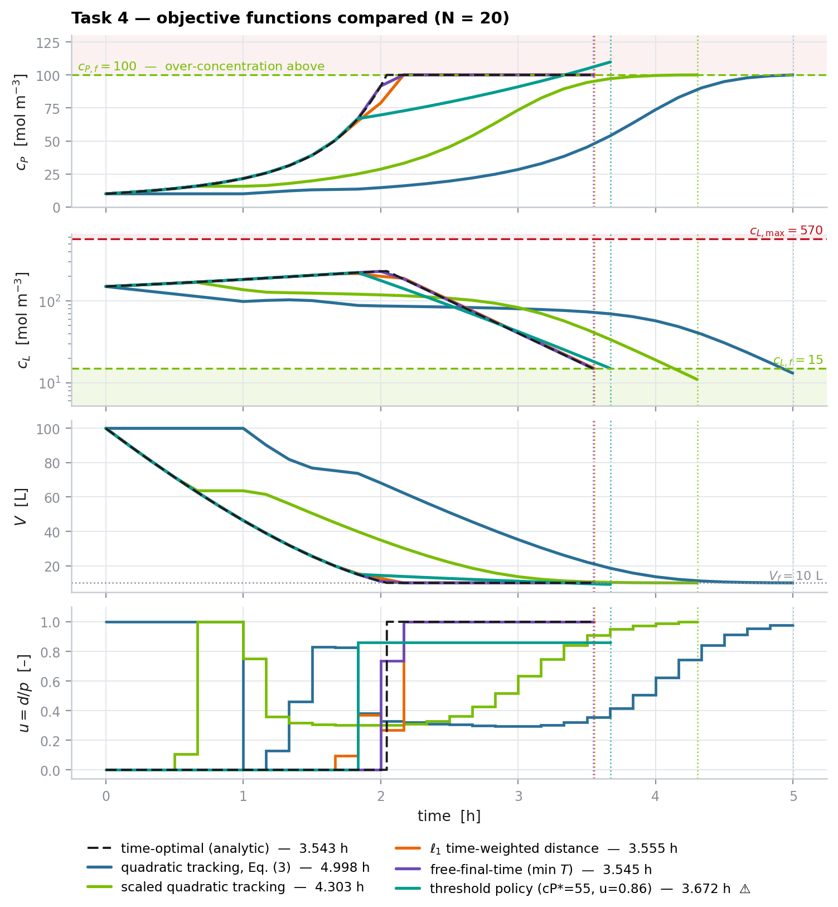

<h1 align="center">Time-Optimal Control of a Batch Diafiltration Process</h1>

<p align="center">
  <em>Advanced Process Control · SS 2025 · TU Dortmund · Prof. Dr.-Ing. Sergio Lucia</em><br>
  <sub>Project&nbsp;P2 — non-linear model, exact time-optimal solution, five MPC objectives,
  robust multi-stage NMPC and moving-horizon estimation</sub>
</p>

<p align="center">
  
  
  
  
</p>

---

## The result in one table

The benchmark asks for the **shortest batch** that takes 100 L of solution from
`cP = 10`, `cL = 150 mol m⁻³` to `cP = 100`, `cL ≤ 15 mol m⁻³` while never
exceeding `cL = 570 mol m⁻³`.  We first derive the **exact** answer, then measure
every controller against it.

| controller | batch time | gap to optimum | on spec? |
|---|---:|---:|:--:|
| **analytic time-optimal solution** (closed form) | **3.5435 h** | — | ✔ |
| direct OCP, 200 free intervals (CasADi/IPOPT) | 3.5435 h | +0.000 % | ✔ |
| free-final-time NMPC, `N = 5 … 50` | 3.5447 h | **+0.04 %** | ✔ |
| ℓ₁ time-weighted NMPC, `N = 20` (fixed 10-min grid) | 3.5547 h | +0.32 % | ✔ |
| heuristic policy of Eq. (4) | 3.6717 h | +3.6 % | ✘ over-concentrates to 110 mol m⁻³ |
| best possible **constant** input (`u = 0.595`) | 5.0471 h | +42 % | ✔ |
| quadratic tracking cost of Eq. (3), `N = 20` | 4.9977 h | +41 % | ✔ |
| quadratic tracking cost of Eq. (3), `N = 5` | never finishes in 6 h | — | ✘ |

<p align="center"></p>

### The optimal policy, in closed form

Using `cP` as the independent variable makes the dynamics **linear in
σ = 1/(1−u)**, which turns the minimum-time problem into a linear program whose
price of one unit of washing, `MP /(p·cP·rL)`, decreases monotonically over the
reachable set.  Therefore

> **concentrate at `u = 0` until `cP = 100 mol m⁻³` (2.0441 h), then wash at
> `u = 1` until `cL = 15 mol m⁻³` (1.4993 h).**

No singular arc appears, the crystallisation limit stays inactive
(`max cL = 231.6 < 570`), and the same policy also minimises **buffer
consumption** — time and solvent do not conflict.  A 200-interval direct OCP
confirms the closed form to 5 × 10⁻⁶ relative.

---

## What is in here

| area | what was done |
|---|---|
| **Model** | 3 states in *hold-up* form `[V, M_L, M_P]`, one symbolic CasADi model shared by simulator, all MPCs and the estimators. Protein passage (Eq. 6) is a genuine state, not a patched attribute. |
| **Theory** | closed-form time-optimal solution + proof of the bang-bang structure; monotonicity of `V` ⇒ `cP` can never overshoot; solvent-optimality equivalence. |
| **Numerics** | RK4 with sub-stepping (verified 4th order against CVODES), collocation coefficients, plant integrated at 5 s while the controller runs at 10 min, **terminal event located by bisection** so batch times are not quantised to the control grid. |
| **MPC** | one builder, five objectives (`tracking`, `tracking_scaled`, `l1_time`, `min_time`, `economic`); ℓ∞ exact-penalty slacks make the NLP feasible for *any* state and horizon; warm starting; the first interval is pinned to Δt so the plan matches what the plant receives. |
| **Robustness** | multi-stage (scenario-tree) NMPC over `kM_L`, constraint back-off, EKF and moving-horizon estimation, adaptive NMPC, 24-plant Monte-Carlo campaign. |
| **Reporting** | `python -m dfp.cli all` regenerates **every** figure and `results/results.json`; `docs/REPORT.md` quotes only numbers from that file. |
| **UI** | Streamlit dashboard (Matplotlib only) that calls exactly the same functions as the report. |
| **Tests** | `pytest` suite covering model invariants, integrator order, optimality, feasibility and constraint satisfaction. |

---

## Quickstart

```bash
git clone https://github.com/sa1ntsinner/diafiltration-project.git
cd diafiltration-project

# environment (conda or pip)
conda env create -f environment.yml && conda activate DFP
# or:  python -m venv .venv && . .venv/bin/activate && pip install -r requirements.txt

# the numbers — works straight from the clone, nothing to install
python run.py optimum --numeric      # analytic + direct-OCP optimum
python run.py bench                  # score every controller
python run.py all                    # regenerate docs/figures + results.json
pytest -q                            # run the test suite

# the dashboard
streamlit run src/dfp/dashboard/app.py
```

`run.py` only puts `src/` on `sys.path`. After `pip install -e .` the same
commands are available as `python -m dfp.cli …` or just `dfp …`.

`python run.py all` runs the ten studies, each in its own subprocess, and caches
them in `results/_studies/` — so `--skip-existing` resumes an interrupted run and
the Monte-Carlo campaign can be grown a few plants at a time.

---

## Answers to the task sheet

| task | where | headline |
|---|---|---|
| ODE model, states, linearity | `dfp/model.py`, `docs/REPORT.md` §2 | 3 states (2 suffice nominally); **non-linear** — `ln(cg V/M_P)`, `exp(p/k_M A)` and the bilinear `u·p` |
| simulate `u = 0.5, 0.6, 0.7`, discuss | §4, `fig04`, `fig05b` | no single `u` is good: on-spec only for `u ∈ [0.595, 0.655]`, best 5.047 h (+42 %) |
| MPC with Eq. (3), `N = 5/20/50`, vs. Eq. (4) | §5, `fig06`–`fig08` | 4.998 h at `N = 20`; `N = 5` never finishes; the cost is a *tracking* cost, badly scaled, and quadratically flat at the target |
| objectives that express time optimality | §6, `fig09`–`fig11` | ℓ₁ distance cost → +0.32 %, free-final-time → **+0.04 %** and horizon-insensitive |
| filter-cake tear (Eq. 5) | §7, `fig12`–`fig13` | MPC exploits the extra flux (3.379 h < 3.545 h) and stays on spec; the fixed policy over-concentrates by 28 % |
| `kM_L` mismatch 0.75/0.5/0.25 × | §8, `fig14`–`fig16` | 0.25 × drives `cL` to 741 mol m⁻³ (+30 % over the limit); back-off is useless, multi-stage NMPC and MHE both restore feasibility |
| protein leakage (Eq. 6) | §9, `fig17`–`fig18` | exponential cliff at `kM_P ≈ 2.8 × 10⁻⁷ m s⁻¹`; above it `u = 1` *reduces* `cP` and the specification becomes unreachable |
| own additions | §3, §10–§11 | closed-form optimum as a benchmark, economic MPC with a day-ahead tariff, Monte-Carlo campaign, real-time timing (worst case 0.073 % of the sampling interval) |

Full discussion, all figures and every number: **[`docs/REPORT.md`](docs/REPORT.md)**.

---

## Repository layout

```text
diafiltration-project/
├── src/dfp/
│   ├── config.py          ProcessParams, uncertainty sets              (SI, mol m⁻³)
│   ├── model.py           symbolic ODE model — single source of truth
│   ├── integrate.py       RK4(+sub-steps), collocation, CVODES
│   ├── plant.py           simulated truth: nominal / tear / mismatch / leakage
│   ├── simulate.py        closed-loop driver, exact batch-time detection, metrics
│   ├── tariff.py          C² day-ahead electricity price
│   ├── estimation.py      EKF, moving-horizon estimation, adaptive NMPC
│   ├── controllers/
│   │   ├── heuristic.py   constant u, Eq. (4) policy, analytic bang-bang law
│   │   ├── nmpc.py        the five MPC objectives (exact-penalty slacks)
│   │   ├── multistage.py  scenario-tree robust NMPC (min–max, non-anticipativity)
│   │   └── ocp.py         closed-form optimum + direct free-final-time OCP
│   ├── experiments/       one function per study  →  figures + results.json
│   ├── viz/               Matplotlib house style, reusable panels, flow sheet
│   ├── dashboard/         Streamlit UI (optional)
│   └── cli.py             list · all · run · optimum · bench · merge
├── run.py                 zero-install entry point (python run.py all)
├── tests/                 pytest: model, control, simulator, estimators
├── docs/REPORT.md         the written report (figures in docs/figures/)
├── assets/P2_Diafiltration.pdf
├── environment.yml · requirements.txt · pyproject.toml · Makefile
```

---

## Notes on the task-sheet data

* The permeation coefficient is printed as `4.79e-6 m s⁻²`; for
  `p = kA ln(cg/cP)` to be a volumetric flow the unit must be `m s⁻¹`.  The
  numerical value is used unchanged.
* Eq. (2)/(6) are only physical for a partition function `γ ≥ 1`: for `γ < 1`
  the denominator `1+(γ−1)e^{p/k_M A}` turns negative.  Complete protein
  retention is therefore modelled by a build flag (`dM_P/dt ≡ 0`), not by
  `β = 0`.
* Concentrations are in `mol m⁻³` throughout, as in the task sheet.
* Allowed packages: **CasADi, NumPy, Matplotlib**.  `scipy` is optional (only a
  convenience path in tests), and Streamlit is needed *only* for the optional
  dashboard — the report pipeline never imports it.

---

## Citing

```bibtex
@misc{mirzayev2025diafiltration,
  author       = {Mirzayev, Elmir and Dharan, Rakesh and Krishan, Kirupa},
  title        = {Time-Optimal Control of a Batch Diafiltration Process},
  year         = {2025},
  howpublished = {\url{https://github.com/sa1ntsinner/diafiltration-project}},
  note         = {Advanced Process Control, TU Dortmund}
}
```

**Contributors** — Elmir Mirzayev ([sa1ntsinner](https://github.com/sa1ntsinner)) ·
Rakesh Dharan ([Rakeshdharan](https://github.com/Rakeshdharan)) ·
Kirupa Krishan ([kirupakrishan](https://github.com/kirupakrishan))

Student project for **Advanced Process Control**, TU Dortmund, 2025.
