# Time-Optimal Control of a Batch Diafiltration Process

**P2 — Advanced Process Control, SS 2025, TU Dortmund**
Elmir Mirzayev · Rakesh Dharan · Kirupa Krishan

> Every number in this report is produced by `python run.py all` and stored in
> [`../results/results.json`](../results/results.json); every figure is written to
> `docs/figures/`. Nothing here is typed in by hand.

---

## 1 Executive summary

| # | question | answer |
|---|---|---|
| 1 | states, linearity | 3 hold-up states `[V, M_L, M_P]` (2 suffice for the nominal plant); the model is **non-linear** — logarithmic flux, exponential partition ratio, bilinear inflow `u·p` |
| 2 | constant `u` | works only for `u ∈ [0.595, 0.655]`; the best constant input needs **5.047 h**, i.e. **+42 %** over the optimum |
| 3 | Eq. (3) with `N = 5 / 20 / 50` | 6 h (never finishes) / **4.998 h** / 5.160 h — worse than the heuristic policy; the cost is a *tracking* cost, badly scaled and quadratically flat at the target |
| 4 | better objectives | ℓ₁ time-weighted distance → **3.555 h** (+0.3 %); free-final-time → **3.545 h** (+0.04 %) and *independent of the horizon* |
| 5 | filter-cake tear | MPC **exploits** the extra flux (3.379 h) and stays on spec; the fixed policy over-concentrates to 127.6 mol m⁻³ (+28 %) |
| A1 | `kM_L` mismatch | at 0.25 × the nominal-model MPC drives `cL` to **741 mol m⁻³** (+30 % over the limit). Back-off is useless; **multi-stage NMPC** and **MHE-based adaptation** both restore feasibility at ≤ 2.4 % time penalty |
| A2 | protein leakage | an exponential cliff at `kM_P ≈ 2.8 × 10⁻⁷ m s⁻¹`; above it `u = 1` *reduces* `cP` and the specification becomes unreachable |
| + | own additions | closed-form optimum as a benchmark, economic MPC with a day-ahead tariff, Monte-Carlo campaign, real-time timing, unit tests |

**The single most useful result** is that this benchmark has a *closed-form*
time-optimal solution (§3). Having the exact answer turns every later question
from "does it look reasonable?" into "how many percent are we from optimal?".

---

## 2 Model

### 2.1 Balances

The feed tank is well mixed and the recirculation loop is fast compared with the
batch, so it is lumped. Writing the balances in **hold-ups** rather than
concentrations keeps them in conservation form:

$$\dot V = d - p = (u-1)\,p, \qquad
  \dot M_L = -c_{L,p}\,p = -r_L\,c_L\,p, \qquad
  \dot M_P = -c_{P,p}\,p = -r_P\,c_P\,p$$

with the algebraic relations of the task sheet

$$c_P=\frac{M_P}{V},\quad c_L=\frac{M_L}{V},\quad
  p = kA\ln\!\frac{c_g}{c_P},\quad
  r_\bullet=\frac{\gamma}{1+(\gamma-1)\exp\!\big(p/(k_MA)\big)},\quad
  \gamma\in\{\alpha,\beta\}.$$

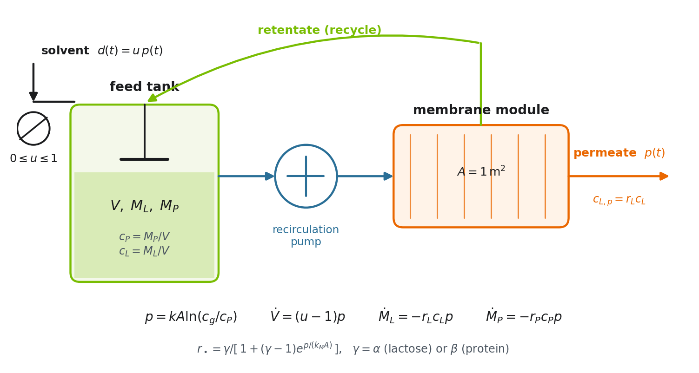

### 2.2 Which states are needed?

Two states suffice for the nominal plant, because protein is retained
completely and `M_P ≡ M_{P,0} = c_{P,0}V_0 = 1 mol` is a constant of the motion.
We nevertheless carry `M_P` as a third state so that

* the *structural* mismatch of Eq. (6) needs **no separate model** — only a flag,
  and
* the balances stay in conservation form, so the integrator conserves mass to
  machine precision (verified in `tests/test_model.py`).

Concentrations are outputs, not states. Choosing `(c_P, c_L)` as states instead
would put a division inside every derivative and destroy exact protein
conservation.

### 2.3 Linear or non-linear?

**Non-linear**, for three independent reasons:

1. the flux contains `ln(c_g V / M_P)` — logarithmic in the state;
2. the partition ratio contains `exp(p/(k_M A))`, i.e. the exponential of a
   logarithm of the state;
3. the manipulated inflow is `d = u · p(V)` — a **product of input and state**
   (bilinear), so even freezing the transcendental terms leaves a non-linear
   system.

No change of coordinates removes all three, so non-linear MPC is required. A
Jacobian at one operating point (`dfp/controllers/ocp.py` and the tube
back-off study) is only useful as an auxiliary tool, never as the control model.

### 2.4 A structural property that we will use repeatedly

Because `u ≤ 1`, `dV/dt = (u−1)p ≤ 0`: **the volume never increases**, hence
`c_P = M_P/V` is monotonically non-decreasing on the nominal plant. The
terminal specification is the *equality* `c_P = c_{P,f}`, so

> the reachable set is a one-parameter family in `c_P`, and any controller that
> lets `c_P` pass 100 mol m⁻³ has produced an **off-spec** batch — the product
> would have to be re-diluted.

This is why every table below reports `cP overshoot` separately from
`batch time`; a policy that "finishes fast" by over-concentrating has not
solved the problem.

### 2.5 Numerics

| check | result |
|---|---|
| observed order of the RK4 scheme (1 h step, `u = 0.3`, reference RK4 4096 sub-steps) | **4.01** |
| CVODES (`atol = rtol = 1e-12`) vs. RK4 with 4096 sub-steps | `1.0 × 10⁻¹⁰` relative |
| sub-steps inside one MPC shooting interval | 4 (adaptive: `⌈h/300 s⌉`) |
| sub-steps inside one plant control interval | 120 → 5 s |

Two numerical decisions matter for the *results*, not just for elegance:

* **Plant sub-stepping.** With a single RK4 step of Δt = 600 s the bang-bang law
  finishes at 3.5442 h instead of 3.5434 h and ends at `c_P = 100.33` instead of
  `99.999 mol m⁻³`. Small, but a *systematic* bias in exactly the quantity being
  optimised — and it grows with the input, because the truncation error scales
  with the flux.
* **Terminal event detection.** The batch ends when
  `g(x) = max{c_{P,f}−c_P, c_L−c_{L,f}} = 0`. Detecting that only on the control
  grid quantises the batch time to **600 s = 4.7 % of the optimum**, whereas the
  *entire* difference between the two best objectives in §6 is **36 s**. Without
  event detection the controllers simply cannot be ranked. We bisect inside the
  last interval to 1 ms.

---

## 3 The exact time-optimal solution

This section is an addition; it is what makes the rest measurable.

### 3.1 Reduction to a linear program

Since `c_P` is monotone (§2.4) it can replace time as the independent variable.
With `σ := 1/(1−u) ∈ [1, ∞)`,

$$\frac{dt}{dc_P}=\frac{M_P}{p\,c_P^{2}}\,\sigma,
  \qquad
  \frac{d\ln c_L}{dc_P}=\frac{1-r_L(c_P)\,\sigma}{c_P},$$

both **linear in σ**. Integrating the second equation and imposing the lactose
specification gives

$$\min_{\sigma\ge 1}\int_{c_{P,0}}^{c_{P,f}}\!\!a(c_P)\,\sigma\,dc_P
  \quad\text{s.t.}\quad
  \int_{c_{P,0}}^{c_{P,f}}\!\!\frac{r_L}{c_P}\,\sigma\,dc_P
  =\ln\frac{c_{L,0}}{c_{L,f}}+\ln\frac{c_{P,f}}{c_{P,0}},
  \qquad a=\frac{M_P}{p\,c_P^{2}} .$$

A linear program in a function: use the minimum effort `σ = 1` everywhere and
place *all* the washing where one unit of washing is cheapest, i.e. where

$$\frac{a(c_P)\,c_P}{r_L(c_P)}=\frac{M_P}{p(c_P)\,c_P\,r_L(c_P)}$$

is minimal. For the given data this price **decreases monotonically** on the
reachable interval `[10, 100] mol m⁻³` (its interior maximum of `p c_P r_L` sits
at `c_P ≈ 127`, outside the reachable set), so the minimiser is the right end
point and **no singular arc exists**.

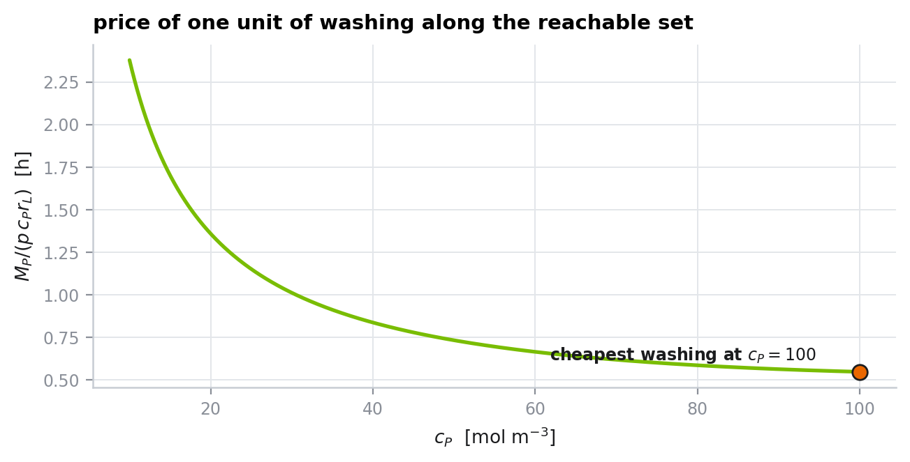

### 3.2 The optimal policy and its batch time

> **Phase 1 — pre-concentration:** `u = 0` until `c_P = 100 mol m⁻³`
> **Phase 2 — constant-volume diafiltration:** `u = 1` until `c_L = 15 mol m⁻³`

$$t_1=\int_{c_{P,0}}^{c_{P,f}}\frac{M_P\,dc_P}{p\,c_P^{2}},\qquad
  c_L(t_1)=c_{L,0}\exp\!\int_{c_{P,0}}^{c_{P,f}}\frac{1-r_L}{c_P}dc_P,\qquad
  t_2=\frac{M_P\ln\big(c_L(t_1)/c_{L,f}\big)}{p(c_{P,f})\,c_{P,f}\,r_L(c_{P,f})}$$

| quantity | value |
|---|---|
| `t₁` (pre-concentration) | **2.0441 h** |
| `c_L` at the switch | **231.59 mol m⁻³** (limit 570 → constraint inactive) |
| `t₂` (washing) | **1.4993 h** |
| **`T*` (optimal batch time)** | **3.5435 h** |
| direct OCP, 200 free intervals | 3.5435 h (relative deviation `4.8 × 10⁻⁶`) |

Two corollaries worth stating:

* **Why "concentrate first" is right.** Washing effectiveness `r_L` *rises* with
  `c_P` (0.704 at `c_P = 10`, 0.913 at `c_P = 100`) and the specific rate
  `p c_P r_L / M_P` rises by a factor **4.3** over the same range. Washing early
  is simply a waste of time.
* **Solvent optimality.** Repeating the argument with the solvent integral
  `∫u p dt` gives the price `M_P/(c_P r_L)`, which is *also* minimal at
  `c_P = c_{P,f}`. **The time-optimal policy is simultaneously
  buffer-optimal** — the two objectives never conflict. This is a genuinely
  useful operating insight and it removes an entire class of "trade-off"
  discussion.

---

## 4 Open loop: constant input (task 2)

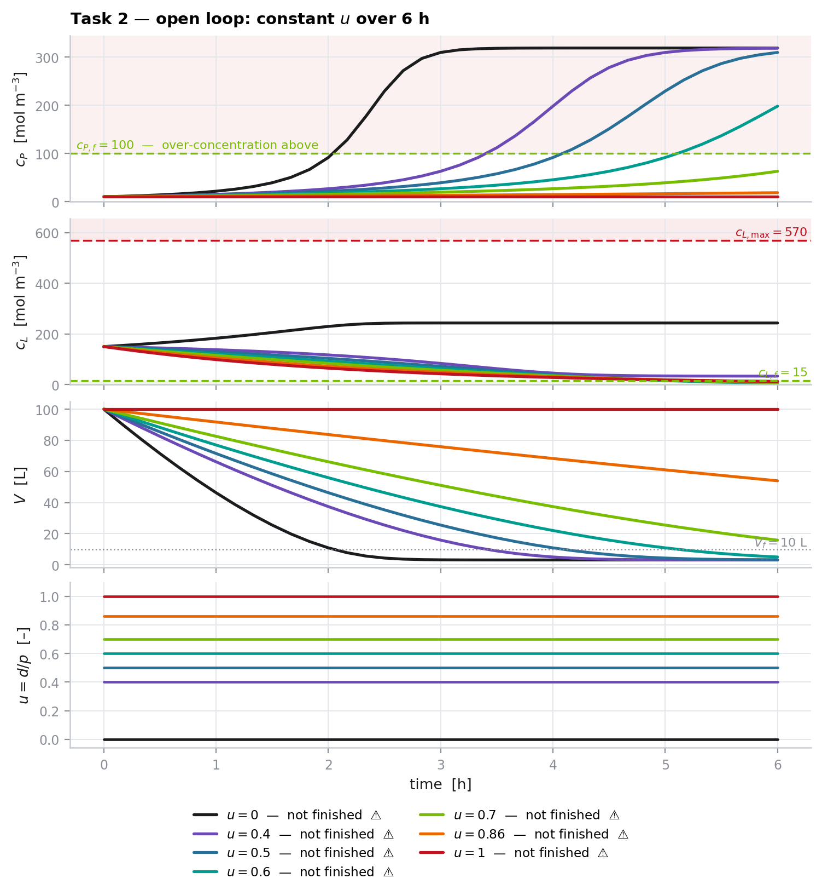
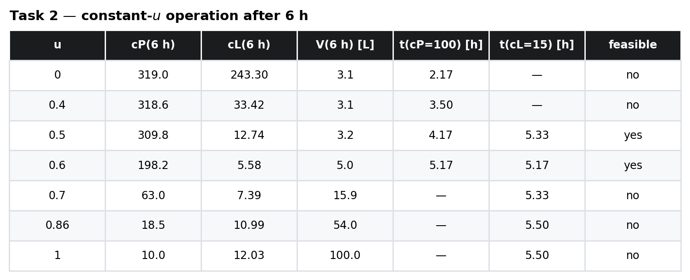

| `u` | `c_P(6 h)` | `c_L(6 h)` | `V(6 h)` | `t(c_P=100)` | `t(c_L=15)` | usable? |
|---:|---:|---:|---:|---:|---:|:--:|
| 0.0 | 319.0 | 243.3 | 3.1 L | 2.17 h | — | no |
| 0.5 | 309.8 | 12.74 | 3.2 L | 4.17 h | 5.33 h | over-concentrated ×3.1 |
| 0.6 | 198.2 | 5.58 | 5.1 L | 5.17 h | 5.17 h | marginal |
| 0.7 | 63.0 | 7.39 | 15.9 L | — | 5.33 h | no |
| 0.86 | 18.5 | 10.99 | 54.0 L | — | 5.50 h | no |
| 1.0 | 10.0 | 12.03 | 100.0 L | — | 5.50 h | no |

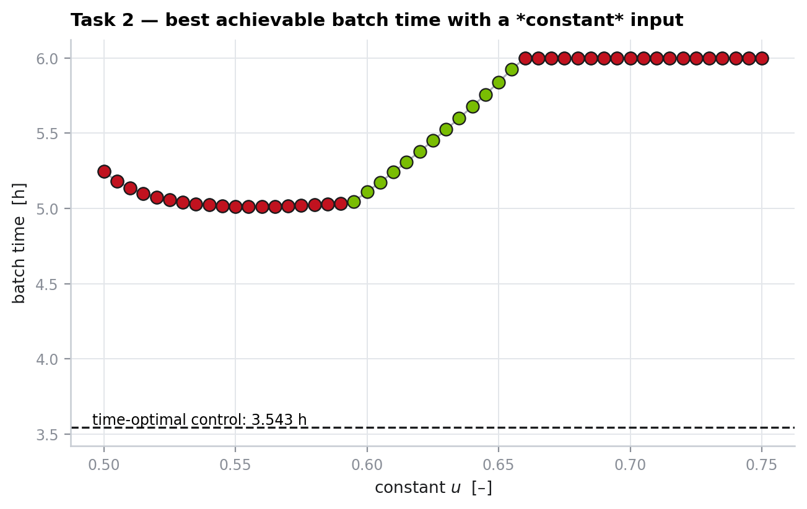

**Observations.** `u` fixes the *ratio* of washing to concentration for the whole
batch, but the process needs opposite settings at its two ends. Small `u`
concentrates quickly and then keeps concentrating: at `u = 0.5` the lactose
target is reached only at 5.33 h, by which time `c_P = 310 mol m⁻³` — a threefold
over-concentration and an off-spec batch. Large `u` washes efficiently but the
protein target is never reached (at `u = 0.7`, `c_P = 63` after 6 h). A fine
sweep shows that both specifications hold simultaneously only for
**`u ∈ [0.595, 0.655]`**, and the best constant input, `u = 0.595`, needs
**5.047 h — 42 % more than the optimum**.

**How does optimisation help?** Exactly because the optimal trade-off is
*time-varying*. An optimiser is free to use `u = 0` while washing is
ineffective and `u = 1` once it is four times more effective, which no constant
input can imitate. It also handles the constraints (`c_L ≤ 570`, `c_P ≤ 100`)
explicitly instead of hoping they hold.

---

## 5 The objective of Eq. (3) and the prediction horizon (task 3)

The objective is implemented exactly as written,

$$J=\sum_{k=0}^{N}\big(c_{L,k}-c_{L,f}\big)^2+\big(c_{P,k}-c_{P,f}\big)^2 ,$$

on the fixed grid Δt = 10 min, with the terminal specification added as a
softened constraint (the task asks to make sure it is satisfied).

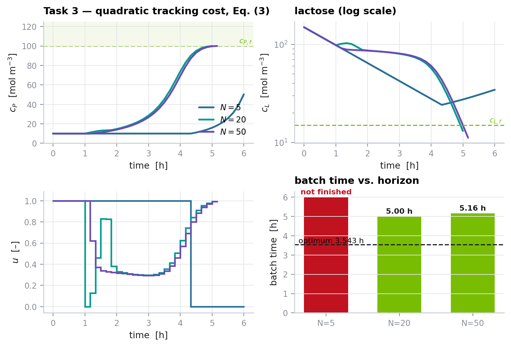

| `N` | batch time | `c_P` final | `c_L` final | samples with active terminal slack | solve time |
|---:|---:|---:|---:|---:|---:|
| 5 | **never finishes** (6 h, `c_P = 50.3`) | 50.3 | 34.6 | 36 / 36 | 2.9 ms |
| 20 | 4.998 h | 100.0 | 13.1 | 9 | 13.2 ms |
| 50 | 5.160 h | 100.0 | 11.2 | 0 | 38.6 ms |

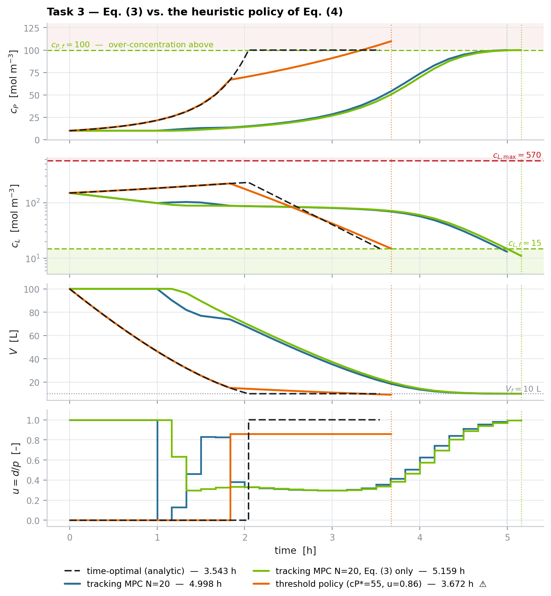
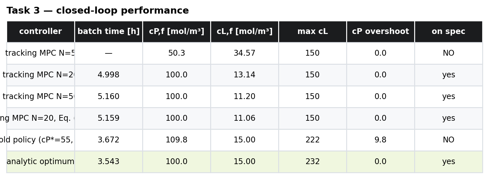

**Influence of the horizon.** With `N = 5` the terminal specification is
*unreachable inside the horizon* — 50 min of prediction cannot cover a 3.5 h
batch — so the terminal slack is active at every single sample and the
controller is purely myopic: it never finishes within 6 h. `N = 20` is long
enough for the terminal constraint to become reachable part-way through the
batch and improves matters, but `N = 50` is **not** better: a longer horizon
lets the *tracking* cost dominate over more samples, so the controller invests
even more effort in early washing. Performance is therefore **non-monotone in
`N`**, which is a strong hint that the objective, not the horizon, is the
problem.

> **Implementation note (a bug worth reporting).** With a hard terminal equality
> and `N = 5` the NLP is genuinely infeasible; IPOPT then returns its last
> iterate and a naive implementation applies the first element of an
> *infeasible* trajectory without any warning. We therefore attach an
> ℓ∞ exact-penalty slack to every terminal and path constraint. The NLP is now
> feasible for any state and any horizon, the solver never fails (0 failures in
> every run reported here), and the number of samples at which a slack is active
> is *logged* — it is the third column of the table above and it is what actually
> diagnoses "the horizon is too short".

**Comparison with the policy of Eq. (4)** (`u = 0` while `c_P < 55`, then
`u = 0.86`): the policy finishes in **3.672 h**, far better than any tracking
MPC, because its structure is a crude approximation of the true bang-bang
optimum. It is, however, **off spec**: it keeps diluting after the protein
target is reached and ends at `c_P = 109.8 mol m⁻³`, 9.8 % over-concentrated.

**Why Eq. (3) is unsuited.** Four independent reasons:

1. **It is a tracking cost, not a time cost.** Every sample away from the set
   point is penalised, so the optimiser is rewarded for *reducing the residual
   early* rather than for *finishing early*. The two are not the same: the
   cheapest way to reduce `(c_L−c_{L,f})²` immediately is to wash at `u = 1`,
   which freezes `c_P` — and the first hour of the `N = 20` run is spent doing
   exactly that (see the input panel of `fig07`).
2. **The two terms are unscaled.** The initial gaps are 135 mol m⁻³ in lactose
   and 90 mol m⁻³ in protein, but the *reachable* rates differ by far more, so
   the lactose term dominates the sum. Normalising each term by its own gap
   (`tracking_scaled`) improves the batch time from 4.998 h to 4.303 h — better,
   but still 21 % from optimal, which proves the problem is structural and not
   just scaling.
3. **A quadratic penalty is flat at the target.** Near the specification the
   marginal cost of one more sample of delay vanishes to second order, so
   "finish one sample earlier" is almost free. The cost simply cannot express
   time optimality.
4. **It has no notion of "done".** The sum runs over a fixed window whatever the
   state, so the controller keeps trading the two residuals against each other
   instead of terminating.

---

## 6 Objectives that do express time optimality (task 4)

Three replacements were implemented and compared under otherwise identical
constraints (same dynamics, same discretisation, same slacks):

| objective | formulation | batch time | gap |
|---|---|---:|---:|
| `tracking` | Eq. (3), literally | 4.998 h | +41.0 % |
| `tracking_scaled` | Eq. (3), each term ÷ its initial gap | 4.303 h | +21.4 % |
| **`l1_time`** | $\sum_k \Delta t\big[1+\rho_L\frac{(c_{L,k}-c_{L,f})_+}{c_{L,0}-c_{L,f}}+\rho_P\frac{(c_{P,f}-c_{P,k})_+}{c_{P,f}-c_{P,0}}\big]$ | **3.555 h** | **+0.3 %** |
| **`min_time`** | $T=\Delta t+(N-1)h$, `h` free, terminal spec hard | **3.545 h** | **+0.04 %** |
| policy of Eq. (4) | — | 3.672 h | +3.6 % |


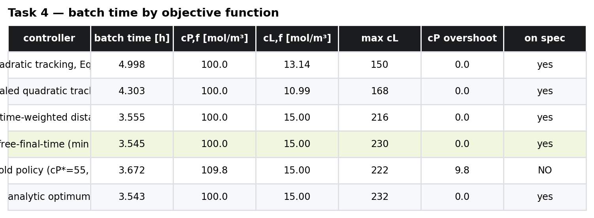

**Why these work.** The hint in the task sheet — *the objective does not need to
be quadratic* — is exactly the point. `l1_time` is a **linear (exact) penalty**
on the remaining distance to the specification, *integrated over time*. A linear
penalty does not flatten out near the target, so ending one sample earlier is
always strictly cheaper; and because the penalty is multiplied by Δt, the
objective literally counts "how long am I still off spec". Both positive parts
are lifted to epigraph variables, so the NLP stays smooth — a plain `fmax` in the
cost made IPOPT fail on about 20 % of the samples in an earlier version.

`min_time` goes one step further and optimises the **final time itself**: the
interval length `h` becomes a decision variable, so the same `N` intervals
always span the *whole remaining batch*. This is the direct discretisation of
the original OCP, which is why it lands within 0.04 % of the analytic optimum (3.5447 h vs 3.5435 h, i.e. 4.6 s).

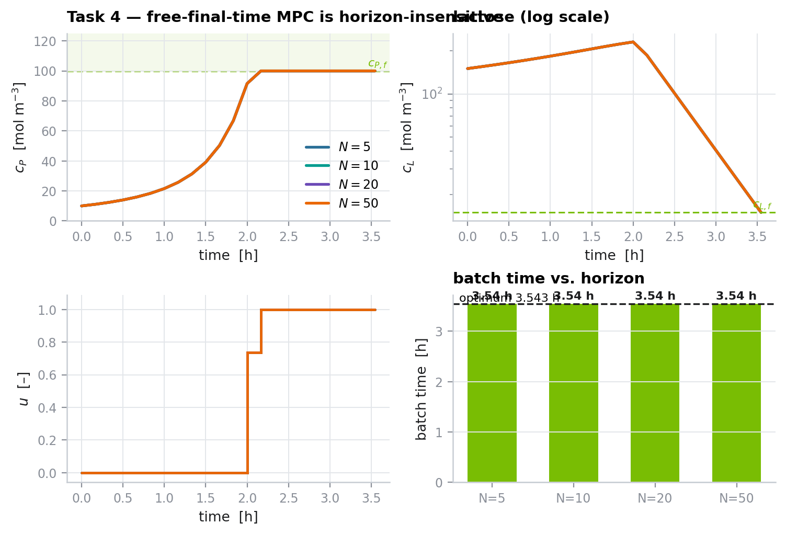

**The horizon sensitivity disappears.** `min_time` gives **3.5447 h for
`N = 5, 10, 20, 50`** — identical to four decimals. Choosing the objective
correctly removes the tuning parameter that dominated §5.

Two implementation details that matter:

* **The first interval is pinned to Δt.** With a *uniform* free grid the
  optimiser plans in intervals of length `h` but the plant receives `u₀` for a
  full Δt; late in the batch (`h ≪ Δt`) that mismatch over-concentrates the
  product by more than 10 %. Pinning interval 0 to the sampling time and letting
  the remaining `N−1` share the free length removes the effect completely
  (`c_P` final = 100.000 mol m⁻³).
* **`c_P ≤ c_{P,f}` is imposed as a path constraint**, which is what actually
  prevents over-concentration when the sampling time is finite.

---

## 7 Filter-cake tear (task 5)

The tear of Eq. (5) doubles the permeate flow while `30 ≤ c_P ≤ 60 mol m⁻³`. It
is implemented as an **exact switch inside the plant model** (never inside an
optimiser) and resolved by the 5 s plant sub-stepping.

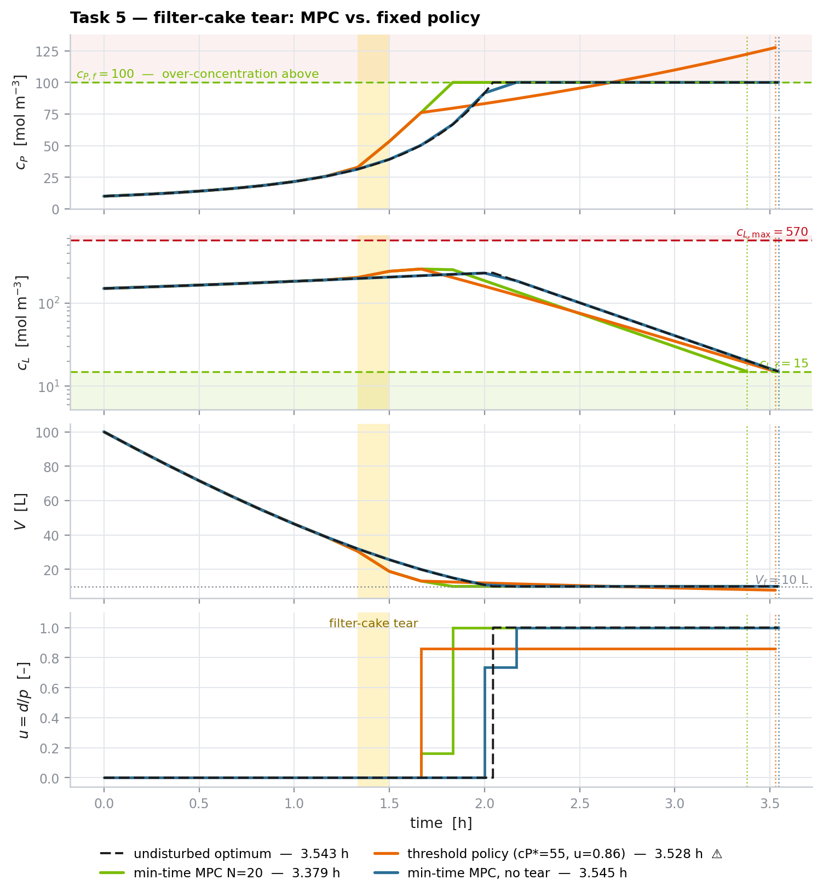
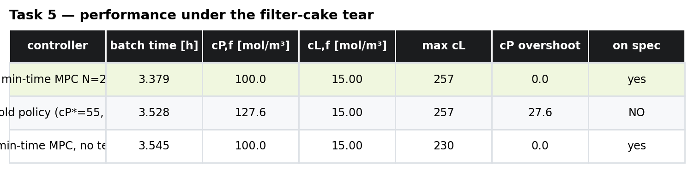

| controller | batch time | `c_P` final | overshoot | peak `c_L` | on spec |
|---|---:|---:|---:|---:|:--:|
| min-time MPC, `N = 20` | **3.379 h** | 100.0 | 0.0 | 257 | **yes** |
| policy of Eq. (4) | 3.528 h | 127.6 | **+27.6** | 257 | **no** |
| min-time MPC, no tear (reference) | 3.545 h | 100.0 | 0.0 | 230 | yes |

**Discussion.** The disturbance is *helpful*: extra permeate flow means faster
concentration, and the MPC finishes **4.7 % faster than on the undisturbed
plant** (3.379 h vs 3.545 h) while landing exactly on the protein set point.
The fixed policy cannot do this. Its switch is triggered by `c_P = 55`, i.e. in
the middle of the tear window, and after switching it has no mechanism at all
for *stopping*: it over-concentrates to 127.6 mol m⁻³, 28 % above specification.

**The advantage of a well-tuned MPC** is therefore not that it rejects the
disturbance, but that it (i) re-optimises from the *measured* state at every
sample, so an unmodelled flux increase is simply exploited, and (ii) carries the
terminal specification and the path constraints *explicitly*, so "faster" never
becomes "off spec". A fixed policy can only ever be tuned for one plant.

---

## 8 Parametric plant–model mismatch in `kM_L` (additional task 1)

The controller keeps the nominal `kM_L`; the plant has
`kM_L,true ∈ {0.75, 0.5, 0.25} kM_L`. Horizon extended to 8 h so the slower
plants can finish.

### 8.1 What happens, and why

`r_L = α/[1+(α−1)exp(p/(k_{M,L}A))]` **decreases** when `k_{M,L}` decreases: a
plant with a smaller mass-transfer coefficient rejects *more* lactose. The
retentate therefore climbs far higher than the controller predicts, and because
the controller's own model reports a harmless `c_L`, it keeps concentrating.

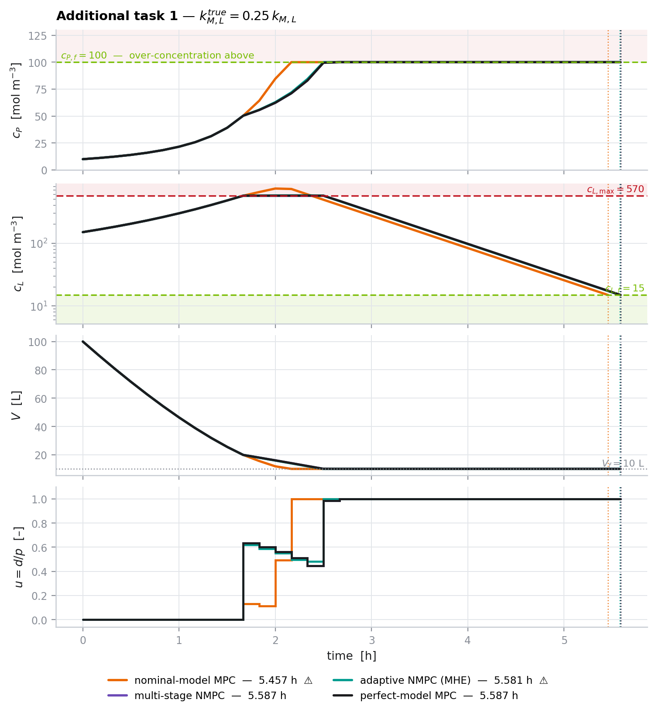

The two milder realisations are shown in
[`fig14_mismatch_0p5`](figures/fig14_mismatch_0p5.png) and
[`fig14_mismatch_0p75`](figures/fig14_mismatch_0p75.png); the full comparison is
collected in

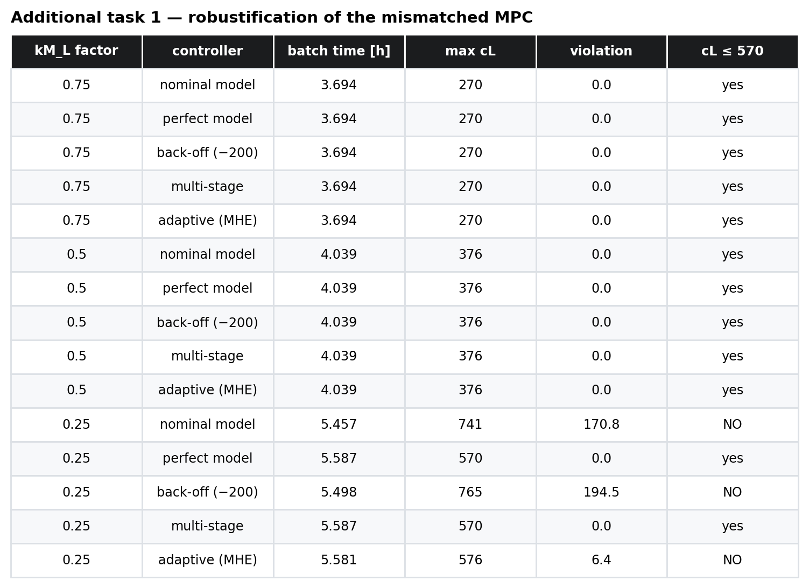

| `kM_L,true` | controller | batch time | peak `c_L` | violation of `c_L ≤ 570` |
|---|---|---:|---:|---:|
| 0.75 × | nominal model | 3.694 h | 270 | none |
| 0.50 × | nominal model | 4.039 h | 376 | none |
| **0.25 ×** | nominal model | 5.457 h | **741** | **+171 mol m⁻³ (+30 %)** |
| 0.25 × | back-off `c_L ≤ 370` | 5.498 h | 765 | +195 mol m⁻³ |
| 0.25 × | **multi-stage NMPC** | 5.587 h | **570.0** | **none** |
| 0.25 × | **adaptive NMPC (MHE)** | 5.581 h | 576.4 | +6.4 mol m⁻³ (1.1 %) |
| 0.25 × | perfect model (lower bound) | 5.587 h | 570.0 | none |

At 0.75 × and 0.5 × **all five controllers produce the identical trajectory**
(3.694 h / 4.039 h, peak 270 / 376 mol m⁻³): the mismatch is real but the
constraint is not active, so there is nothing to robustify. Only the 0.25 ×
case separates them.

**Can the constraints still be satisfied?** Down to 0.5 × yes, without any
change: the specification is met and the crystallisation limit stays inactive;
the batch is simply 14 % longer. At 0.25 × **no** — the limit is violated by
30 %, i.e. lactose would crystallise and the batch would be lost.

**Comparison with the perfect-model MPC.** The perfect-model MPC needs
5.587 h — *longer* than the 5.457 h of the mismatched one. That is not a
paradox: the mismatched controller is "faster" only because it violates the
constraint it does not know about. The honest comparison is
`5.587 h vs infeasible`.

### 8.2 Robustification

Three remedies were implemented.

**(a) Constraint back-off** (`c_L ≤ 570 − 200`) — *fails*. Tightening a bound
only helps if the prediction is right; here the *prediction itself* is biased,
the tightened bound never becomes active in the optimiser, and the closed loop
is unchanged. A useful negative result: back-off is the wrong tool for a
parametric bias.

**(b) Multi-stage (scenario-tree) NMPC** — *works*. The uncertainty is
represented by the four discrete realisations of the task sheet. Up to the
robust horizon `N_r = 1` all branches share the input (non-anticipativity);
afterwards each branch may recover with its own sequence, which models the fact
that future measurements *will* reveal the plant. The min–max objective is
written in epigraph form so the NLP stays smooth:

$$\min_{u,h}\ \max_j\ \big[\Delta t+(N-1)h^{(j)}\big]\quad\text{s.t. dynamics, }
  u^{(j)}_k=u^{(0)}_k \text{ for } k<N_r,\ \text{constraints on every branch}.$$

The result is the best of both worlds: **it matches the perfect-model batch time
at every one of the four realisations, with zero constraint violation, and costs
nothing at all on the nominal plant** (3.545 h, i.e. still the optimum). Because
the branches are re-initialised from the measured state at every sample, the
formulation is far less conservative than an open-loop worst case. Price: four
branches → 140 ms per sample on average instead of 13 ms, still well under
0.1 % of the sampling interval.

**(c) Moving-horizon estimation + adaptive NMPC** — *works, and is cheapest*.
Because `theta` enters the NLP as a *parameter*, the estimate can be pushed into
the controller without rebuilding anything. From the two measurements that a
membrane plant has anyway — tank level and an inline lactose assay,
`y = [V, c_L] + noise (2·10⁻⁴ m³, 2 mol m⁻³)` — an MHE over an 8-sample window
identifies the factor to within a few percent after ≈ 1 h of operation:

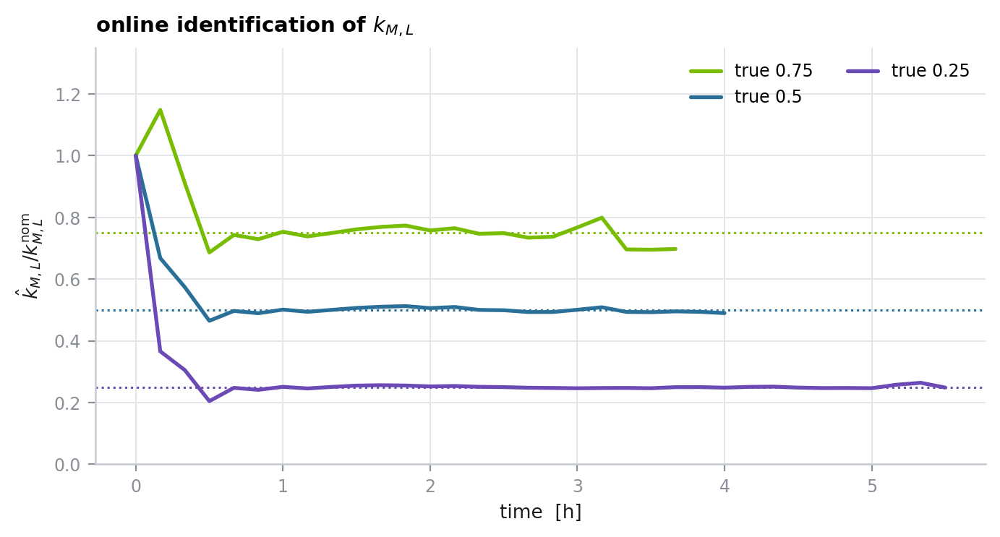

| true factor | MHE estimate mid-batch | error |
|---:|---:|---:|
| 0.75 | 0.773 | +3.1 % |
| 0.50 | 0.506 | +1.2 % |
| 0.25 | 0.247 | −1.2 % |

The adaptive controller then reproduces the perfect-model performance and cuts
the constraint violation at 0.25 × from **171 to 6.4 mol m⁻³** (1.1 % of the
limit) while finishing marginally *earlier* than the robust controller
(5.581 h vs 5.587 h) — it converges to the truth instead of hedging against the
whole set. Its one honest weakness is visible at the very end of every run: as
`c_L → 15 mol m⁻³` the signal approaches the sensor noise floor and the
parameter becomes **unidentifiable**, so the estimate drifts. It no longer
matters — the batch is finished — but it is the reason a *robust* formulation
and an *adaptive* one are complementary rather than competing.

An EKF on the augmented state `[V, M_L, M_P, ln κ]` was also implemented
(`dfp/estimation.py`). It tracks the parameter but is markedly noisier than the
MHE, which is expected: the MHE can bound `κ` and re-use a whole window of data,
while the EKF must commit to a single linearisation per step.

---

## 9 Structural plant–model mismatch: protein leakage (additional task 2)

Eq. (6) is activated in the plant, `dM_P/dt = −r_P c_P p` with
`r_P = β/[1+(β−1)exp(p/(k_{M,P}A))]`, `β = 1.3`.

> **Modelling note.** In the previous version of this project protein leakage
> was implemented by mutating a Python attribute *inside* the right-hand side.
> Because RK4 evaluates the RHS four times per step, the hold-up was advanced
> four times per step with the wrong step length and the "plant" was no longer a
> well-defined dynamic system — results depended on the integrator. Protein is
> now a genuine state, and `tests/test_model.py` asserts that the trajectory is
> invariant when the number of sub-steps is increased tenfold.

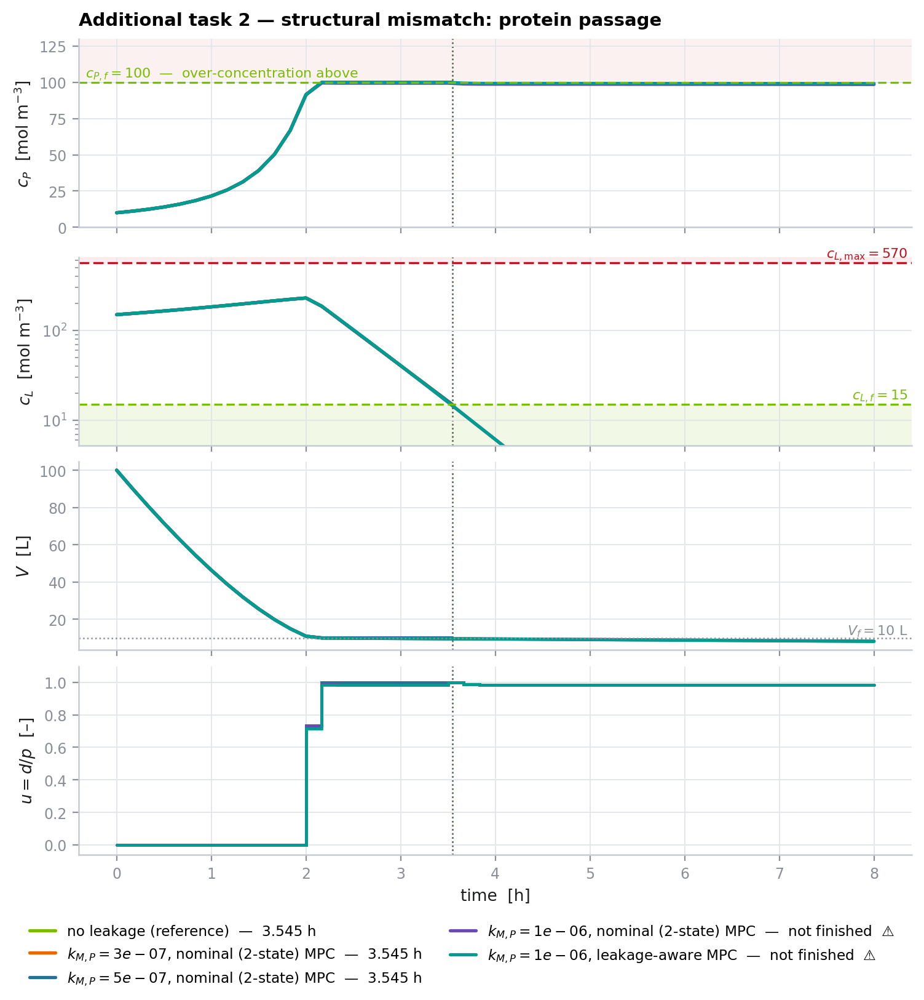
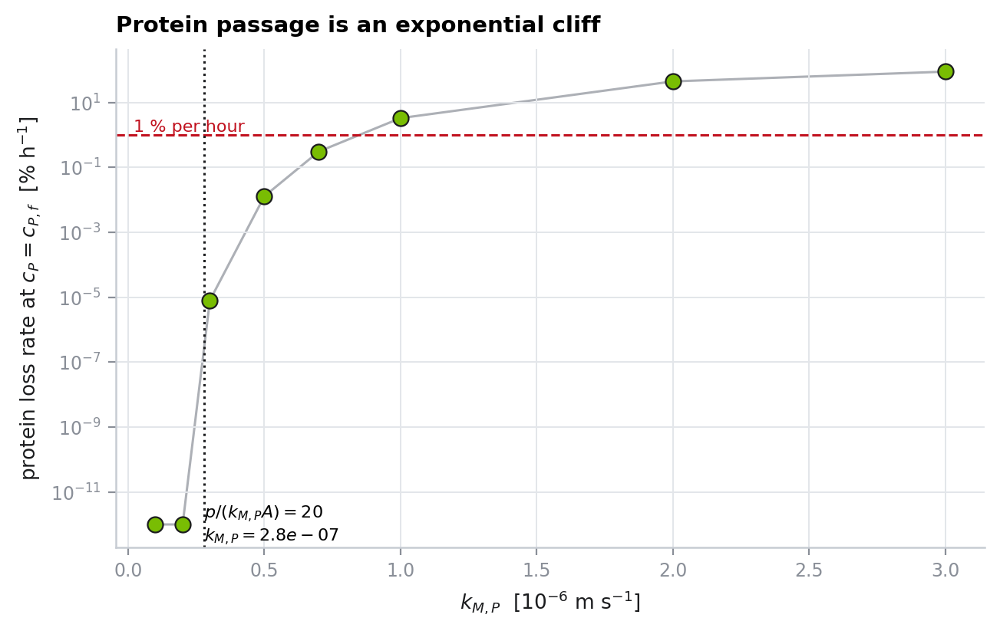
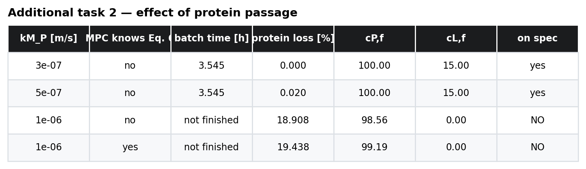

| `k_{M,P}` | MPC knows Eq. (6) | batch time | protein loss | `c_P` final | on spec |
|---|:--:|---:|---:|---:|:--:|
| — (no leakage) | — | 3.5447 h | 0 | 100.00 | yes |
| 3 × 10⁻⁷ | no | 3.5447 h | < 10⁻⁴ % | 100.00 | yes |
| 5 × 10⁻⁷ | no | 3.5447 h | 0.020 % | 100.00 | yes |
| 1 × 10⁻⁶ | no | never finishes | **18.9 %** | 98.56 | no |
| 1 × 10⁻⁶ | yes | never finishes | 19.4 % | 99.19 | no |

**An exponential cliff.** `r_P` is governed by `exp(p/(k_{M,P}A))`, so the effect
is essentially binary. Loss rate at the set point:

| `k_{M,P}` [m s⁻¹] | 1 × 10⁻⁷ | 3 × 10⁻⁷ | 5 × 10⁻⁷ | 7 × 10⁻⁷ | 1 × 10⁻⁶ | 2 × 10⁻⁶ | 3 × 10⁻⁶ |
|---|---:|---:|---:|---:|---:|---:|---:|
| loss [% h⁻¹] | 0 | 8 × 10⁻⁶ | 0.013 | 0.31 | **3.31** | 44.6 | 89.3 |

The practical threshold is where the exponent reaches ≈ 20, i.e.
`k_{M,P} = p(c_{P,f})/(20A) ≈ 2.8 × 10⁻⁷ m s⁻¹`; below it the nominal two-state
model is exact for all practical purposes and the batch time is unchanged to
four decimals.

**A structural consequence.** With leakage,

$$\frac{dc_P}{dt}=\frac{p\,c_P}{V}\big(1-u-r_P\big),$$

so at `u = 1` the protein concentration **decreases**. The classical
"concentrate, then wash at constant volume" structure — optimal for the nominal
plant — now actively *destroys* the protein specification, and washing must be
carried out at `u < 1 − r_P` with a slowly shrinking volume. Above
`k_{M,P} ≈ 10⁻⁶ m s⁻¹` the pair (`c_P = 100`, `c_L ≤ 15`) becomes unreachable
within 8 h **even for a controller that knows Eq. (6) exactly**: the limitation
is the plant, not the controller. Making the controller aware of the leakage
improves the terminal protein concentration (98.6 → 99.2 mol m⁻³) but cannot
restore feasibility.

---

## 10 Economic MPC with a day-ahead tariff (own addition)

The objective becomes `J = c_t·T + ∫λ(t)·(P_idle + P_dyn·u) dt`, with a C²
interpolated German day-ahead price curve (a piecewise-linear tariff puts a kink
on every hour boundary and slows IPOPT noticeably). The wall-clock start time is
passed into the NLP as a parameter (`closed_loop(..., t0=...)`), so the
controller really does see which hours lie ahead of it and could shift work into
the cheap ones.

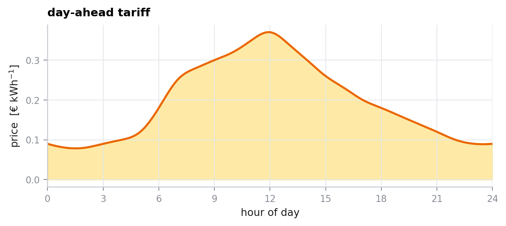

### 10.1 There is no economic trade-off — and that is a result

Sweeping the value of time from **0 to 30 €/h** changes the batch time by
**0.0 s** and the energy by **0.0000 kWh**: every economic MPC reproduces the
time-optimal policy exactly (3.5447 h, 5.524 kWh, 30.2 L of buffer). The reason
is structural, not numerical. With `P = P_idle + P_dyn·u` the bill is

$$\int\lambda\,P\,dt \;=\; P_\text{idle}\!\int\!\lambda\,dt
  \;+\; P_\text{dyn}\!\int\!\lambda\,u\,dt ,$$

and §3.2 showed that the **solvent** integral `∫u p dt` is minimised by the very
same bang-bang policy as the batch time (same linear program, price
`M_P/(c_P r_L)`, again minimal at `c_P = c_{P,f}`). Shorter batch, less pumping
*and* less buffer all point the same way, so the tariff — whose spread is only
4.6× — can never pay for a detour. **The time-optimal policy is unconditionally
the economic optimum for this plant.**

### 10.2 What *does* pay: scheduling

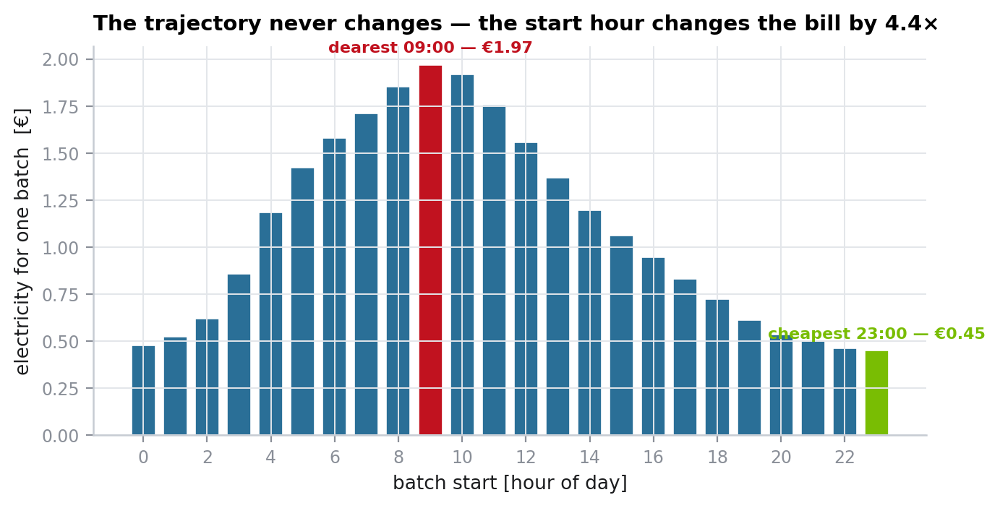
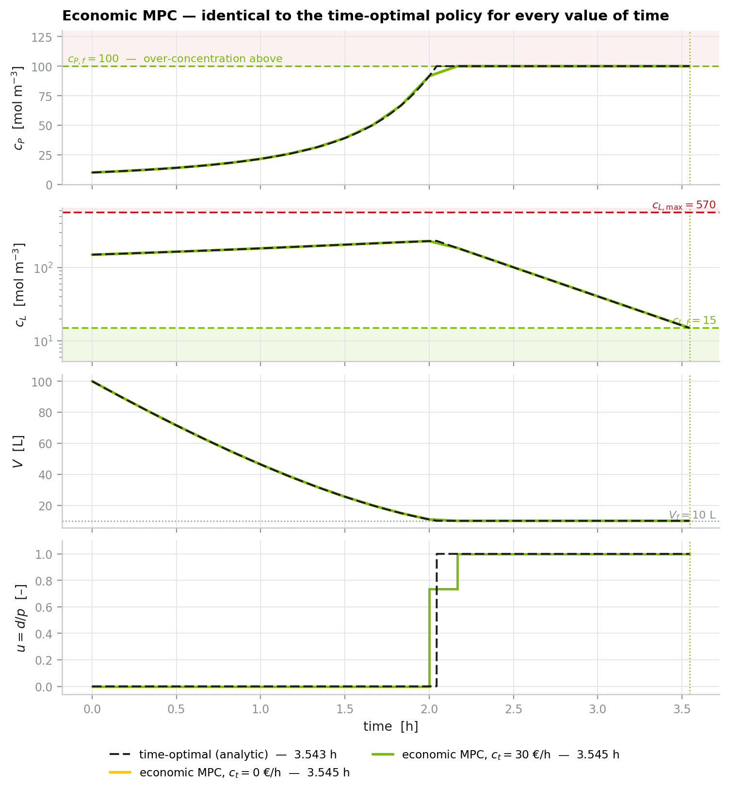

The same batch, run with the same policy, costs

| | start | electricity |
|---|---|---:|
| cheapest | **23:00** | **€0.45** |
| dearest | 09:00 | €1.97 |

a factor **4.38** — decided entirely by *when* the batch is scheduled and not at
all by *how* it is controlled. For this process the useful conclusion for an
operator is therefore: spend the effort on the schedule, run every batch
time-optimally.

> Where a genuine trade-off *would* appear is a pump whose power grows with the
> transmembrane pressure, i.e. with `c_P`. Then washing at `c_P = c_{P,f}` — the
> time-optimal choice — is also the most expensive moment to wash, and the two
> objectives separate. That is a one-line change to the power model in
> `ClosedLoopResult.energy` and the natural extension of this section.

## 11 Robustness campaign and real-time feasibility (own addition)

A Monte-Carlo campaign draws random plants with
`kM_L ∈ [0.25, 1.10]`, `k ∈ [0.80, 1.20]`, `α ∈ [0.95, 1.15]`,
`c_g ∈ [0.95, 1.05]` × nominal (24 plants, horizon `N = 10`), while the
controller always keeps its **nominal** model.

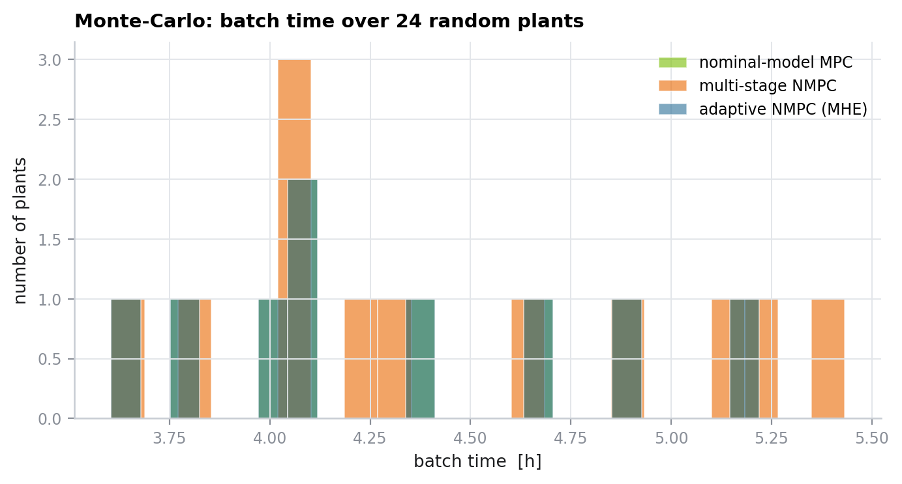
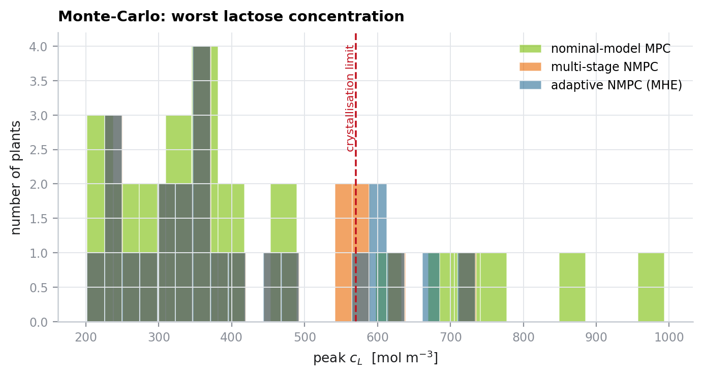
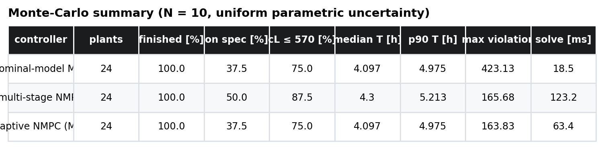

| controller | finished | on spec | `c_L ≤ 570` | median `T` | p90 `T` | worst violation | solve |
|---|---:|---:|---:|---:|---:|---:|---:|
| nominal-model MPC | 100 % | 37.5 % | 75.0 % | 4.10 h | 4.98 h | 423 mol m⁻³ | 19 ms |
| **multi-stage NMPC** | 100 % | **50.0 %** | **87.5 %** | 4.30 h | 5.21 h | **166** | 123 ms |
| adaptive NMPC (MHE) | 100 % | 37.5 % | 75.0 % | 4.10 h | 4.98 h | 164 | 63 ms |

Two honest observations:

* **Robustness only covers the uncertainty you model.** The scenario tree spans
  `kM_L ∈ {0.25 … 1}` only, while the campaign also perturbs `α`, `c_g` and `k`.
  Multi-stage NMPC still halves the worst violation and lifts constraint
  satisfaction from 75 % to 87.5 %, but it is not a guarantee outside its own
  set. Extending the tree over `α` as well is the obvious remedy — and it costs
  a factor equal to the number of extra branches.
* **The residual off-spec batches are a *sampling* problem, not a robustness
  problem.** Every draw finishes, and part of the failures are `c_P` overshoot
  rather than lactose. Isolating the mechanism with a single mismatched
  permeability:

  | plant | Δt | `c_P` final | overshoot | on spec |
  |---|---:|---:|---:|:--:|
  | `k` × 0.8 | 600 s | 100.000 | 0.000 | yes |
  | `k` × 1.0 | 600 s | 100.000 | 0.000 | yes |
  | `k` × 1.2 | 600 s | 101.783 | **1.783** | **no** |
  | `k` × 1.2 | 120 s | 100.165 | 0.165 | yes |
  | `k` × 1.2 | 30 s | 100.165 | 0.165 | yes |

  A 20 % permeability error moves `c_P` past its **equality** specification
  inside a single 10-minute sample. Shortening the control interval near the end
  of the batch removes it, changing nothing else — the cheapest possible fix, and
  a reminder that an equality end-point specification and a coarse sampling time
  are a bad combination whatever the controller.

**Real-time feasibility.** Per sample, against a control interval of 600 s:

| controller | mean | max | max / Δt |
|---|---:|---:|---:|
| min-time NMPC, `N = 5` | 15.5 ms | 27.1 ms | 0.005 % |
| min-time NMPC, `N = 10` | 13.6 ms | 29.0 ms | 0.005 % |
| min-time NMPC, `N = 20` | 13.3 ms | 31.8 ms | 0.005 % |
| min-time NMPC, `N = 50` | 25.2 ms | 79.7 ms | 0.013 % |
| multi-stage NMPC, `N = 20`, 4 branches | 139.8 ms | 437.6 ms | **0.073 %** |

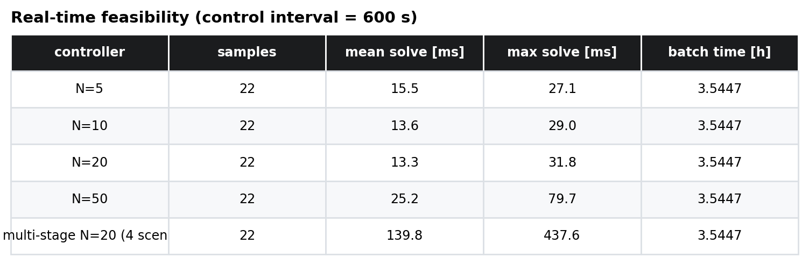

Even the robust formulation uses three orders of magnitude less time than it
has. Nothing in this benchmark needs an approximation for computational
reasons — worth stating explicitly, because it means the *only* justification for
a simpler controller would be simplicity itself.

## 12 Conclusions

1. **Know the answer first.** The benchmark has a closed-form time-optimal
   solution (3.5435 h; `u = 0` then `u = 1`, switching exactly at
   `c_P = c_{P,f}`, no singular arc). It also turns out to be
   *buffer*-optimal. Having it converts controller design from an aesthetic
   exercise into a measurement.
2. **The objective, not the horizon, decides.** The quadratic tracking cost of
   Eq. (3) is 21–41 % from optimal and *non-monotone* in `N`; a free-final-time
   objective is within 0.04 % for every `N` from 5 to 50. An ℓ₁ cost on the
   remaining distance gets within 0.3 % on the fixed 10-min grid.
3. **Feasibility must be engineered, not assumed.** Exact-penalty slacks turn a
   silently-infeasible NLP into a controller that always returns a usable input
   *and reports* when the horizon is too short.
4. **Numerical hygiene changes conclusions.** The control grid is 600 s wide,
   while the gap between the two best objectives is 36 s: without bisected
   terminal-event detection the ranking of §6 is pure noise. Plant sub-stepping
   removes a further systematic bias of 2.8 s and 0.33 mol m⁻³.
5. **Feedback beats a fixed policy, and constraints are the reason.** Under the
   filter-cake tear the MPC turns the disturbance into a 4.7 % *gain* while the
   heuristic policy goes 28 % off spec.
6. **Against parametric bias, tighten nothing — learn or branch.** Back-off is
   ineffective; multi-stage NMPC and MHE-based adaptation both restore
   feasibility, the former without any extra sensor, the latter without any
   extra conservatism. They fail in complementary situations, which argues for
   combining them (multi-stage over the *estimator's* remaining uncertainty) as
   the natural next step.
7. **Economics adds nothing here — scheduling does.** Time, solvent and pump
   energy are minimised by the *same* policy, so the economic MPC is degenerate
   (0.0 s spread over `c_t ∈ [0, 30] €/h`); but the start hour changes the
   electricity bill of one batch by a factor 4.4.
8. **Structural mismatch can remove feasibility altogether.** Protein passage
   above `k_{M,P} ≈ 10⁻⁶ m s⁻¹` inverts the sign of `dc_P/dt` during
   constant-volume washing and makes the specification unreachable — no
   controller can fix a plant that cannot do the job.

---

### Reproducing this report

```bash
python run.py all              # every figure + results/results.json
python run.py bench            # the scoreboard of §1
python run.py optimum -n       # §3, analytic and numerical
pytest -q                      # the assertions behind every claim
```
